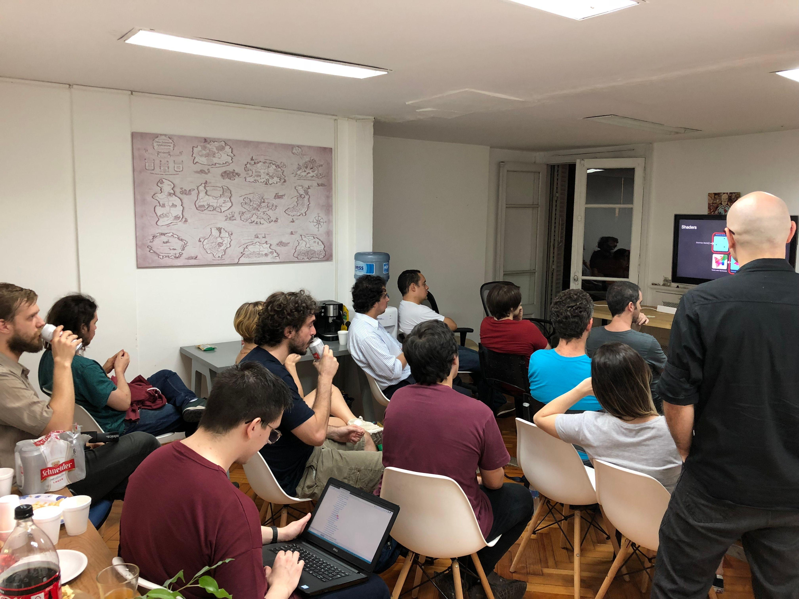

# Nuestra Comunidad

La comunidad de Rust en Argentina es pequeña pero creciente.

Desde 2018 hemos organizado meetups de Rust en la Ciudad Autónoma de Buenos Aires, dado clases por invitación en facultades publicas y gestionado acercar oradores del exterior para dar charlas y conocer a la comunidad.

Si estas interesado o interesada en aprender Rust, o estas llevando a cabo un proyecto con tecnología asociada, te invitamos a acercarte y participar.

El sitio en Meetup punto com de la comunidad es: Rust-Argentina También tenemos un un canal en Telegram. Agradecemos a LambdaClass por su apoyo a la comunidad.