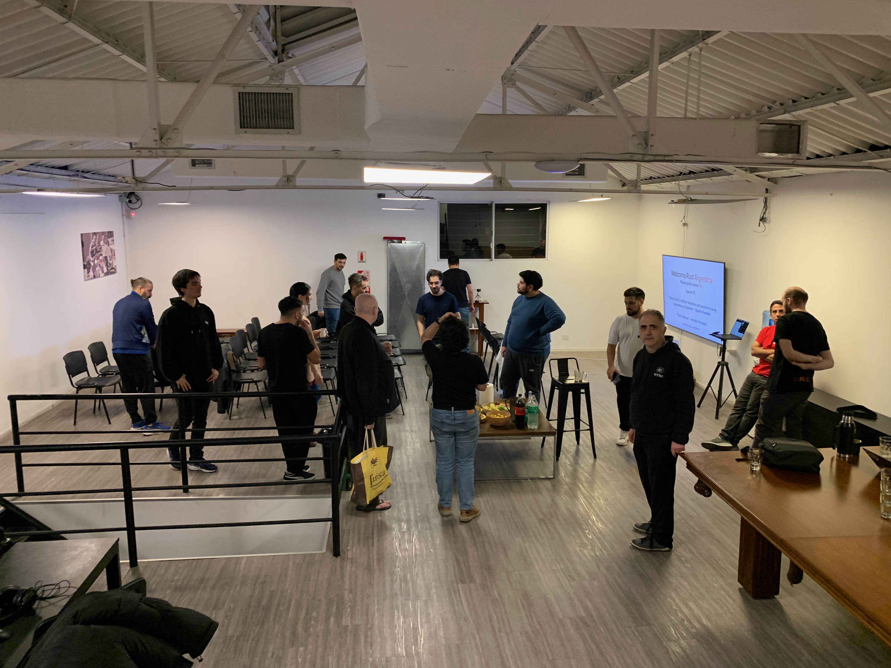
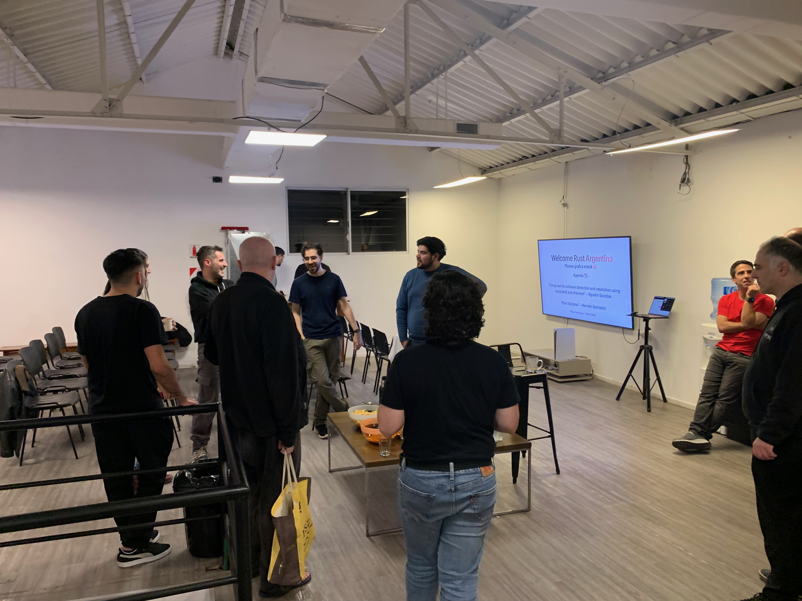
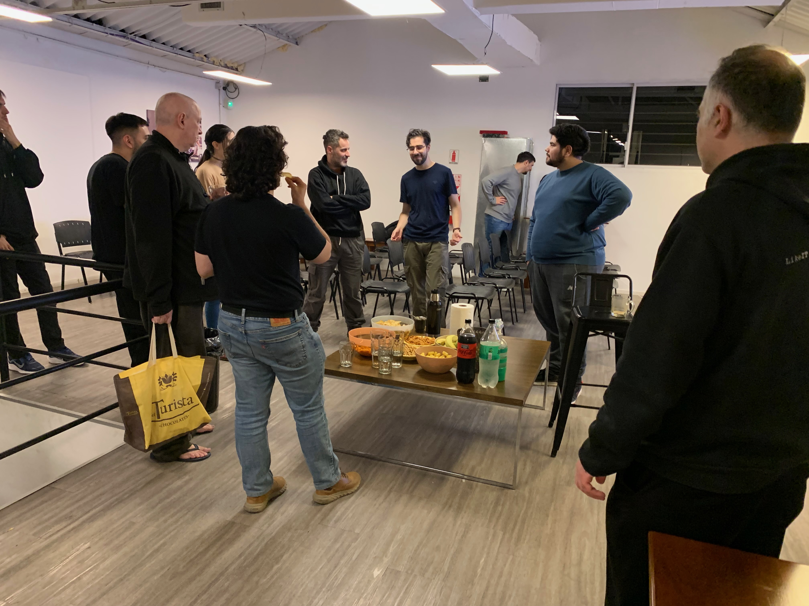
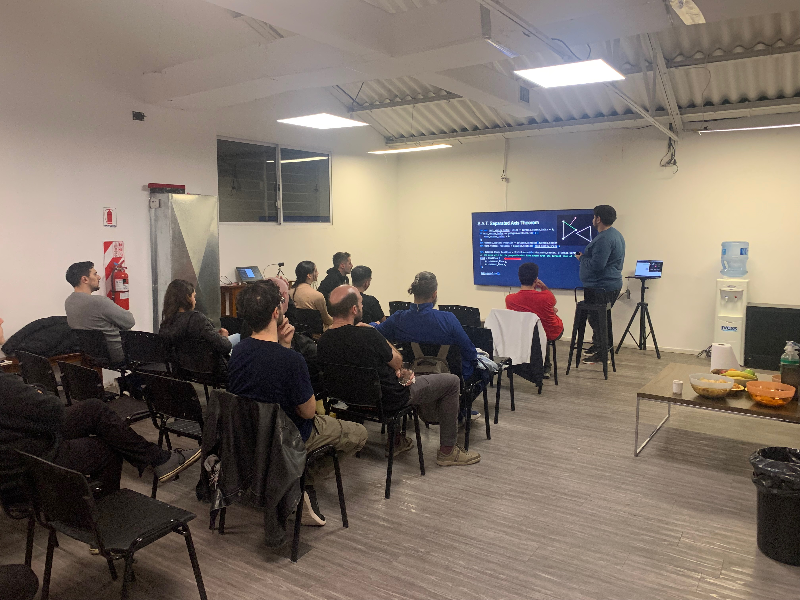
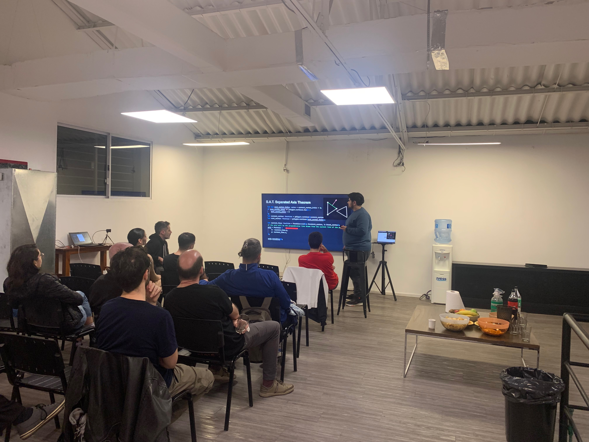
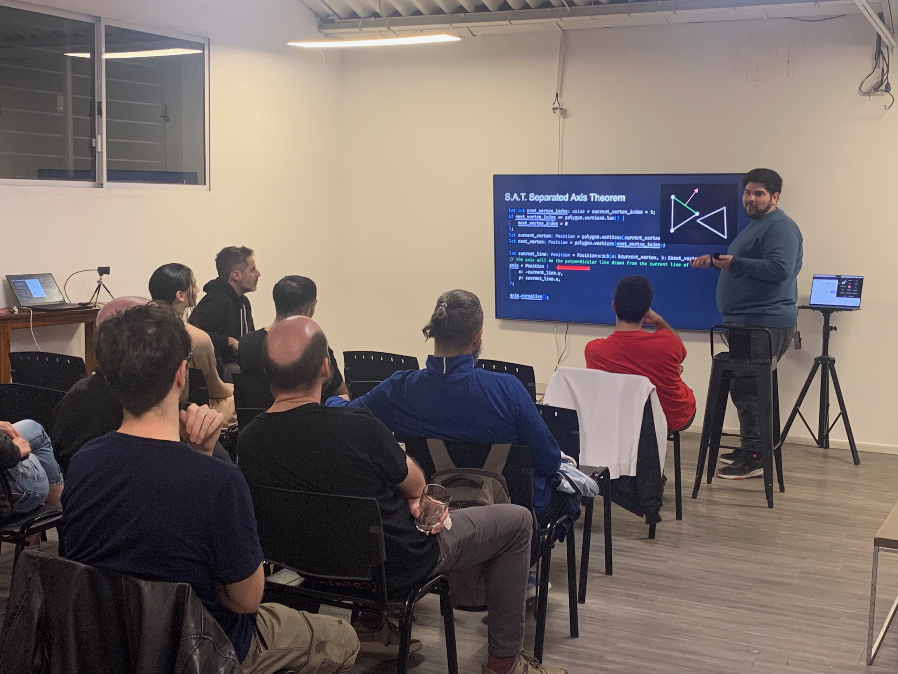
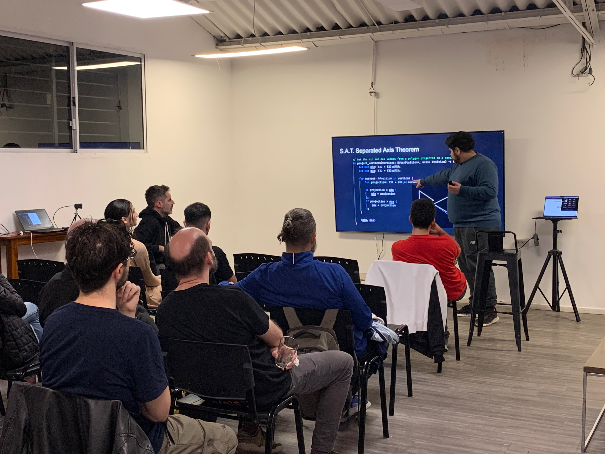
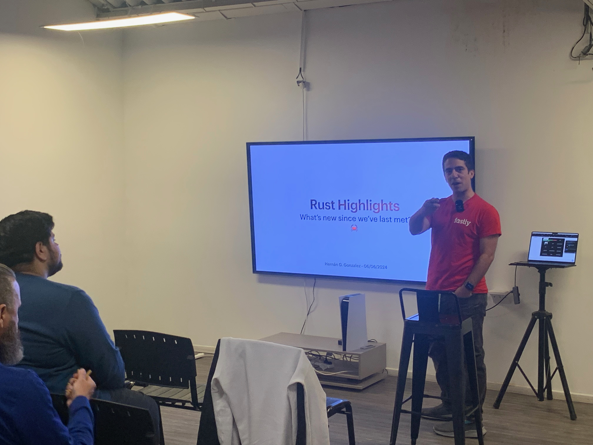
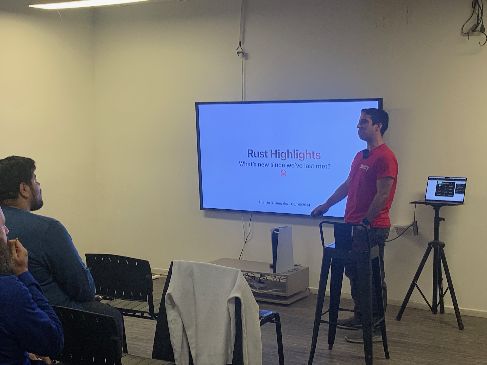
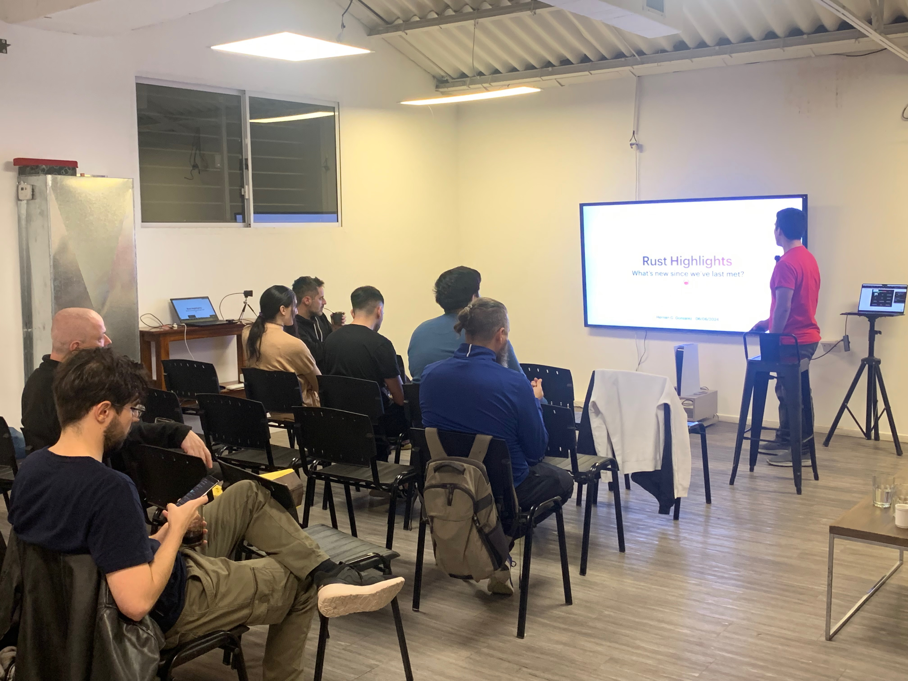

# Collision Detections with Rust
- Description: Using rust for collision detection and resolution using separated axis theorem
- Author: "Agustin Escobar"
- GitHhub: [@agustinesco](https://github.com/agustinesco)
- Slides: [PDF](collisions.pdf)

# June Rust News
 - Author: "Hernán G. Gonzalez"
 - Github: [@hernangonzalez](https://github.com/hernangonzalez)
 - Slides: [PDF](udpates-24-06.pdf)

# We Meet
Pictures from our event and social :) 

   
   
   

# Recording
