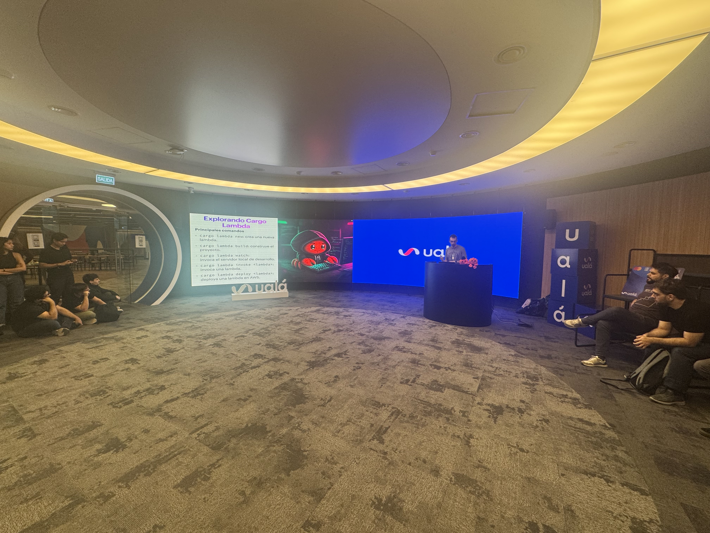
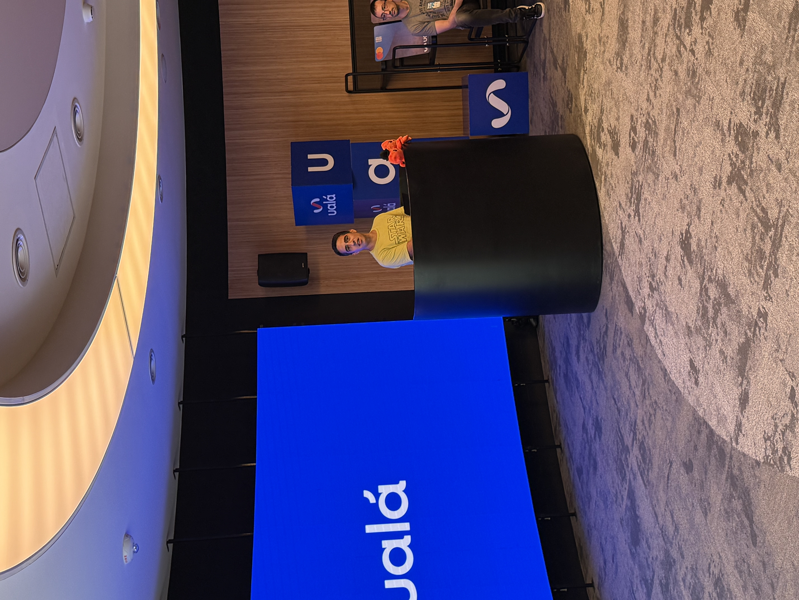
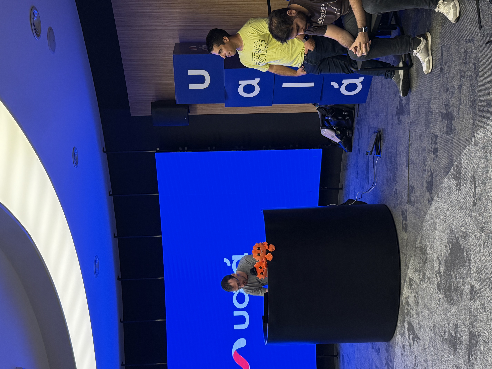
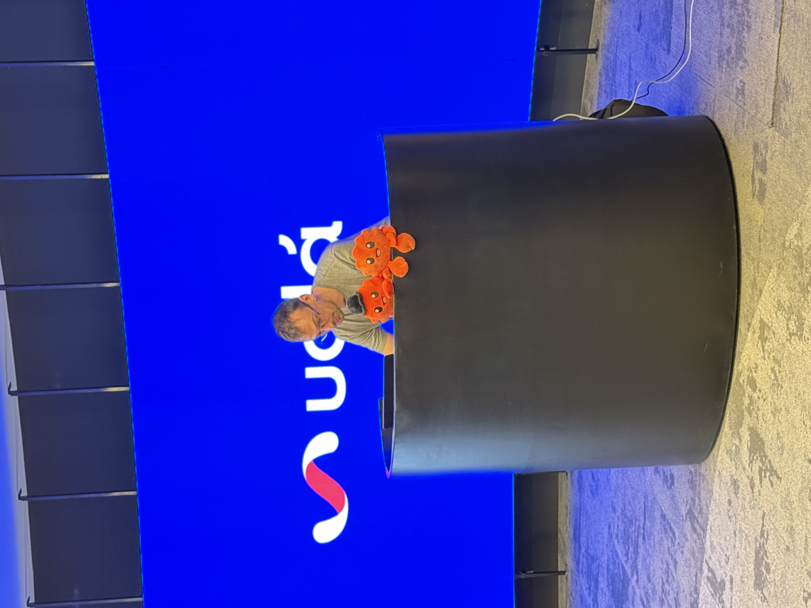
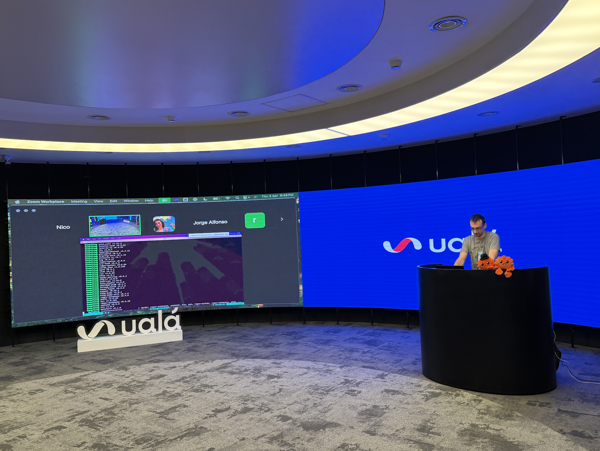
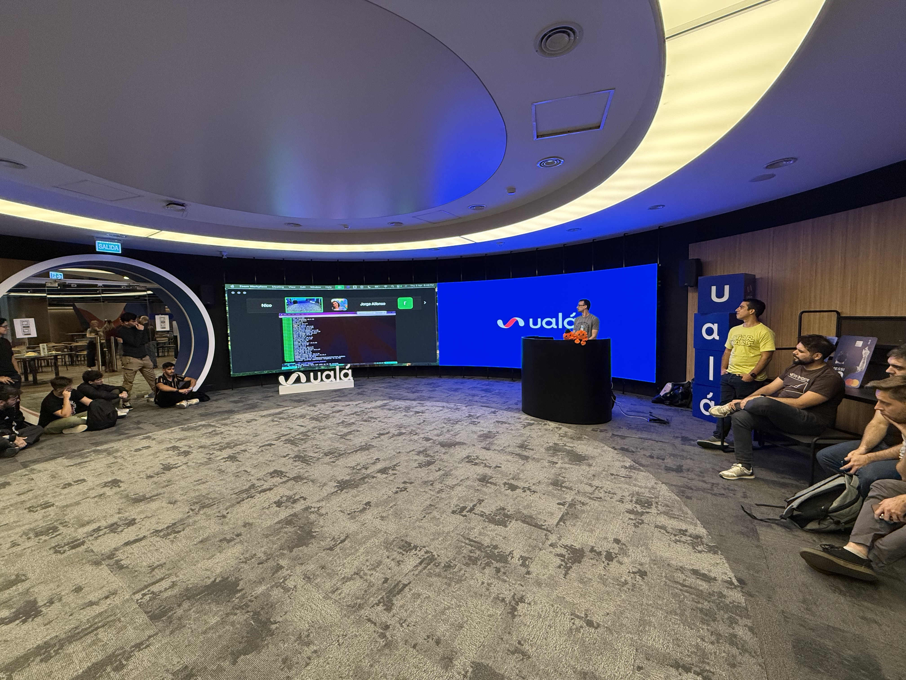
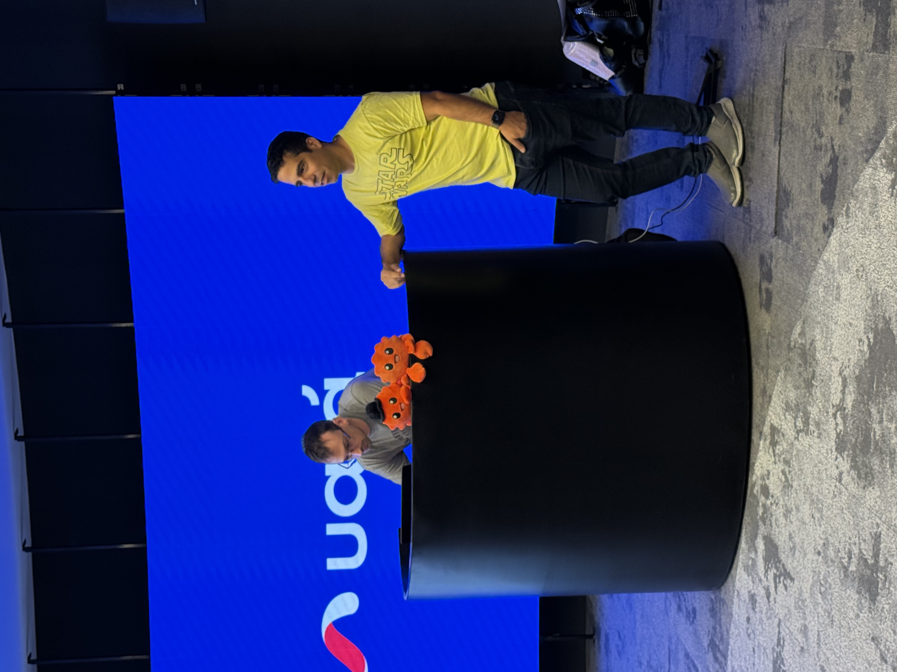
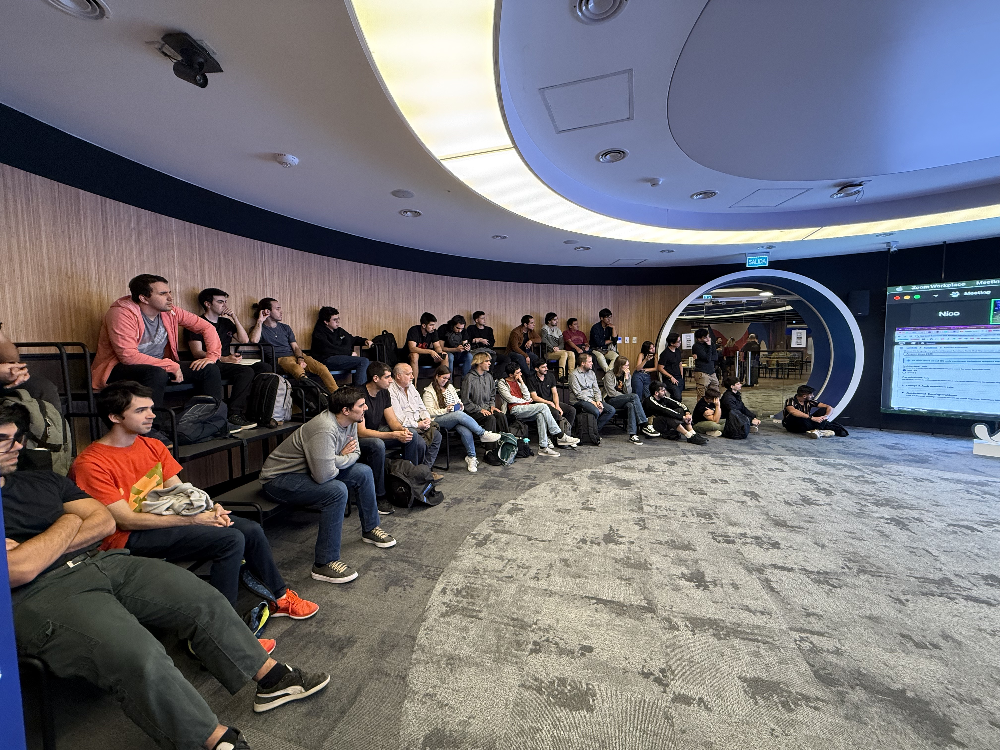
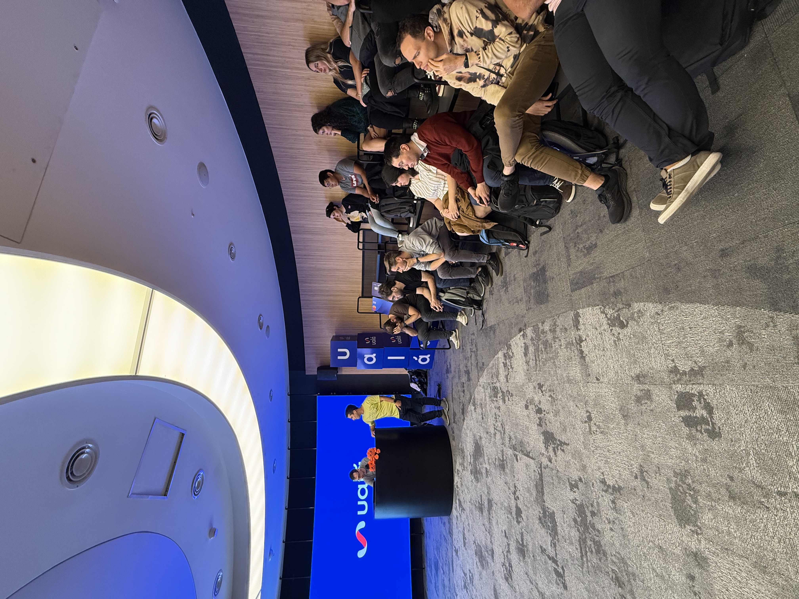

# Lambdas y más!
---
📢 ¡Nuevo meetup de Rust en abril! 🚀

Nos juntamos a aprender de Cargo, AWS Lambdas, Rust en la nube y los beneficios y desafíos de Rust en producción.

En esta edición, tuvimos unas charlas imperdibles:

🔹 [Hernán G. Gonzalez](https://www.linkedin.com/in/nicolas-antinori/) - Anuncios de la comunidad, tenemos Edicion 2024, y compartimos los updates de Rust 1.86.0.

🔹 [Nicolás Antinori](https://www.linkedin.com/in/nicolas-antinori/) - Creando un authorizer en AWS con cargo-lambda
Aprenderemos cómo utilizar cargo-lambda para desarrollar y desplegar un authorizer en AWS, facilitando la autenticación y autorización en arquitecturas serverless.

🔹 [Alejandro Leiton](https://www.linkedin.com/in/alejandro-leiton/) - Tips para Rust en entornos empresariales
Consejos prácticos y estrategias para adoptar Rust en empresas. Exploramos casos, cómo entrenar equipos en el lenguaje y el estado actual de la comunidad de Rust.

🔹 [Fernando Pastorelli](https://www.linkedin.com/in/fernando-pastorelli/) - Nos compartió su experiencia proponiendo la addición del feature `input!()` al leanguaje.

# Los Slides
Los contenidos que vimos en las charlas, los podes [leer aquí](slides.pdf)

# Las fotos del evento

  
 
 
 
 
 

# Recording
_coming soon_