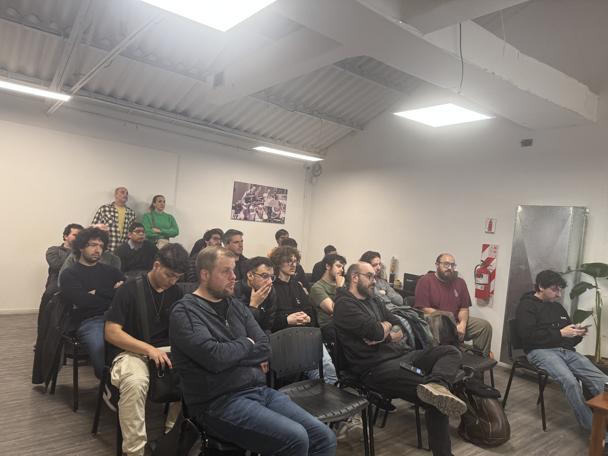
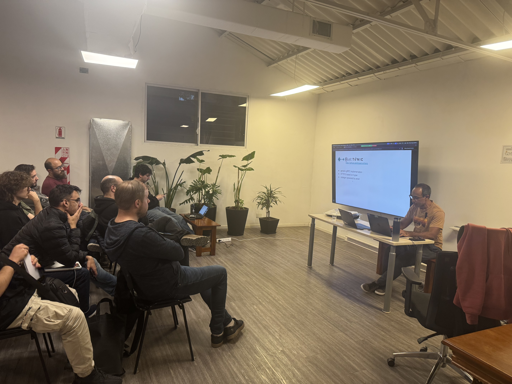

# gRPC y Protocol Buffers!
---

¡Nos volvemos a ver para hablar de Protocol Buffers, gRPC, y preparamos un Hackathon con puro Rust 🦀!

Están invitados a sumarse con una gran agenda:
🔹 Networking y Snacks - 30 mins.
Nos pusimos al día desde nuestro ultimo encuentro y charlamos las novedades de Rust y la comunidad.

🔹 Alejandro Gonzalez - Protocol Buffers - 18:30hs
En esta charla exploraremos el mundo gRPC y cómo implementarlo en Rust. Comenzaremos por Protocol Buffers, el corazón de gRPC, para después construir un servicio completo. Definiremos e implementaremos un sistema de chat que servirá como ejemplo práctico para demostrar las capacidades de gRPC: streaming bidireccional y la interoperabilidad con clientes desarrollados en diferentes lenguajes de programación..

Los repos con todo el código de la charla:
* [gRPC](https://github.com/oxidar-org/rust-grpc-sample)
* [Proto](https://github.com/oxidar-org/rust-proto-sample)

![]

🔹 Networking y Snacks - 30 mins.
Jugamos nuestro primer quiz sobre Rust. Regalamos el buzo de LambdaClass y la primer remera de Oxidar. Fue un éxito de diversión, que llegó para quedarse :D

# Recording


# Las fotos del evento
 
